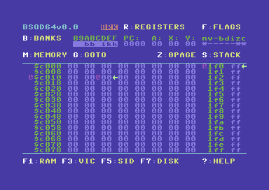

# BSOD64 #

BSOD64 is a "Blue Screen of Death" and debugger for your Commodore 64 programs.

 

Why would anybody want this?

## Easy Error Feedback ##

If you're new to C64 assembly programming it will strike you just how difficult it is to catch errors. If something goes wrong, the machine will just keep running and glitch-out and there's really no easy way to get feedback on *where* the error occurred, or to put a message on screen without writing a _lot_ of code.

BSOD64 is the `alert(...)` of the C64 world.

## Distributable to End-Users ##

Beta-testing? How are you going to get end-users to be able to tell you where the program crashed? What the state of the stack was?

BSOD64 can be included in your program to catch things that "shouldn't be possible" and give users an easy error-message they can send to you.

## Test Inscrutable Systems ##

What if you're testing on an emulator or system -- XBox, Wii, PSP -- that doesn't have a debugger? No way to inspect the state of the memory?

(TODO: photo of BSOD64 running on PSP-Vice)

BSOD64 gives you a way to test and debug on fixed systems where you can't "just install a debugger" and debug issues unique to emulators that won't ever be updated again.